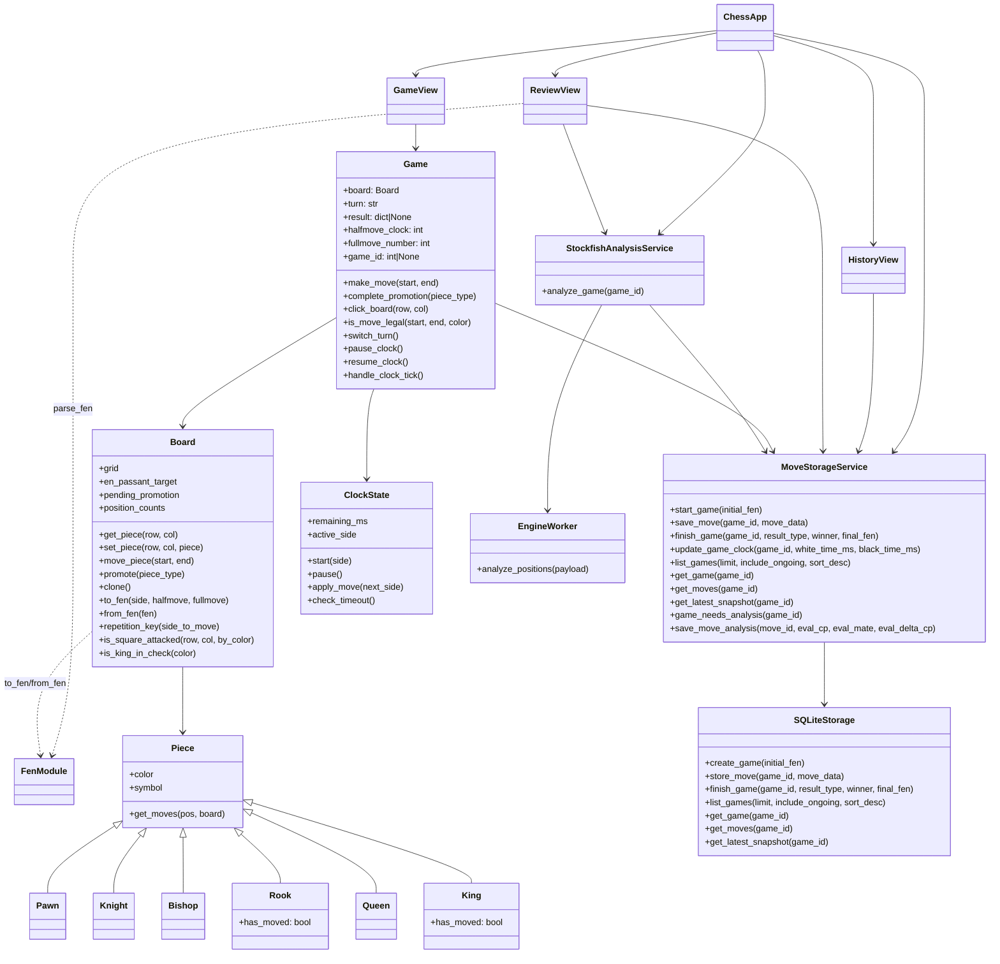
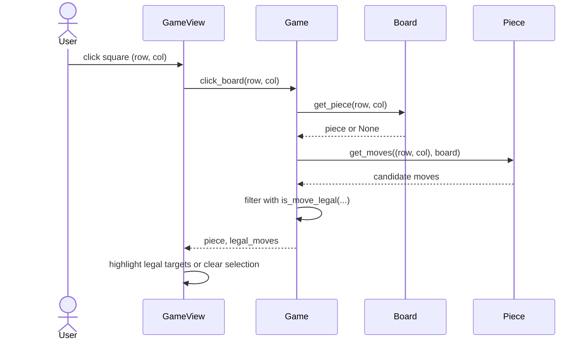
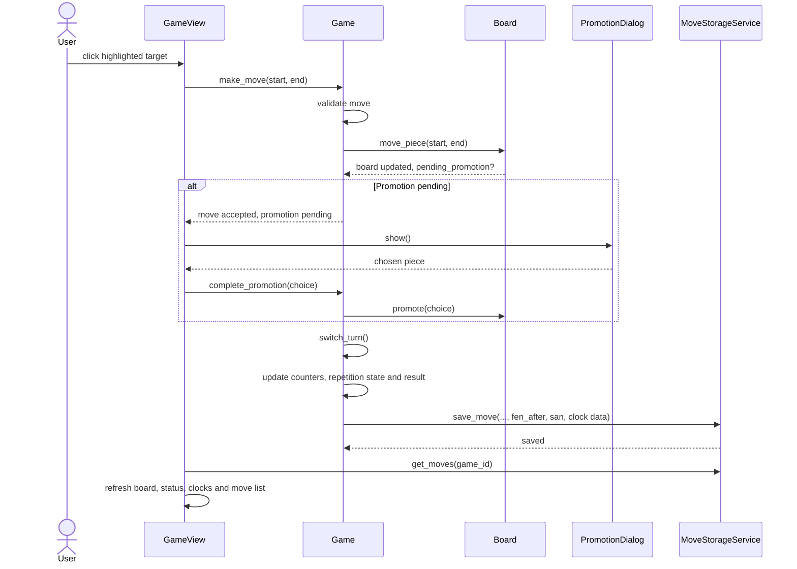
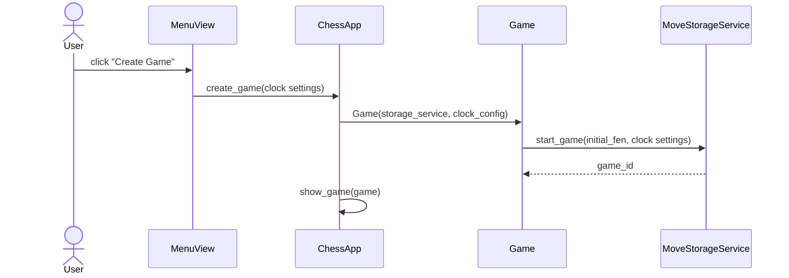
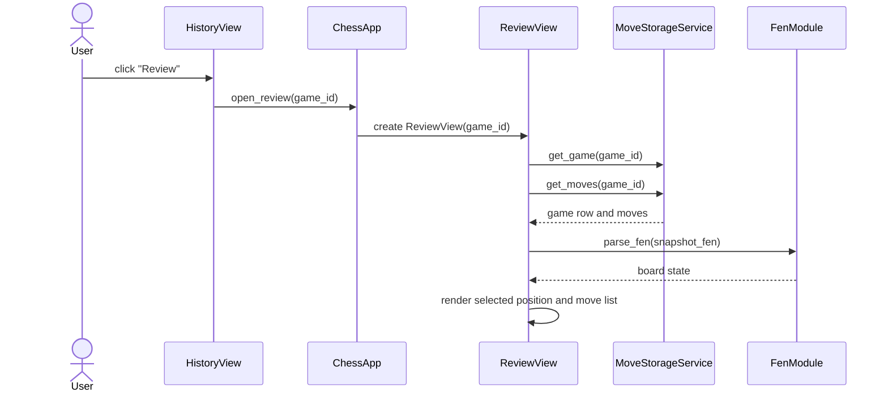

# Architecture

## Structure

The project uses a package structure under `src/`, where responsibilities are
split into three main areas:

- `src/ui/`
  - graphical user interface
  - view management in `ui/app.py`
  - views in `ui/views/`
  - reusable widgets and dialogs in `ui/widgets/` and `ui/dialogs/`
- `src/logic/`
  - chess rules and application logic
  - board representation, pieces, FEN handling, clocks, and game state
- `src/persistence/`
  - SQLite storage, schema creation, and persistence service used by the game
  - Stockfish engine loading, worker process execution, and analysis saving

Other relevant files are:

- `src/ui.py`, which acts as the application entry point
- `src/init_db.py`, which initializes the database manually when needed
- `src/tests/`, which contains the automated tests
- `assets/`, which contains the chess piece images used by the UI and docs images

## User interface

The graphical interface contains four main views:

- `MenuView`
- `GameView`
- `HistoryView`
- `ReviewView`

Only one view is active at a time. View creation, navigation, geometry changes,
and returning to previous views are handled by `ChessApp` in `src/ui/app.py`.

The UI is separated from the chess rules themselves. `GameView` communicates with
the `Game` object for board interaction, move validation, promotion, and clock
handling. History and review related views fetch stored game data through
`MoveStorageService`. `ReviewView` also uses `StockfishAnalysisService` to run
and cache engine analysis for finished games.

## Application logic

The main logic is centered around the `Game` class. `Game` owns the current
position, handles move validation and rule enforcement, tracks clock state,
updates game-end conditions, generates SAN notation, and persists moves through
the storage service.

The main classes and their relationships are described below.

`Board`, `Piece`, and the FEN helpers form the lower-level chess model.
`Game` builds on top of them and represents a complete playable game.

## Persistence

Persistence is handled through `MoveStorageService` in `src/persistence/service.py`,
which wraps `SQLiteStorage` in `src/persistence/storage.py`. Finished games can
also be analyzed through `StockfishAnalysisService` in
`src/persistence/analysis_service.py`, which runs a separate worker process from
`src/persistence/engine_worker.py` and saves per-move evaluations back to the
database.

The default database path is `data/chess.db`, unless another path is given
through the `CHESS_DB_PATH` environment variable or through the `--db-path`
argument of `src/init_db.py`.

The schema is defined in `src/persistence/schema.sql`. 

The database contains two main tables:

- `games`
  - stores the initial and final FEN of a game
  - stores game result metadata
  - stores whether the game is ongoing or finished
  - stores time control and remaining clock information
- `moves`
  - stores one row per ply
  - stores move coordinates, moved piece, optional promotion, SAN notation,
    elapsed move time, the FEN snapshot after the move, and optional stored
    engine evaluation fields

This stored move history is used both for continuing unfinished games and for
reviewing finished ones.

## Main functionality

The following sequence diagrams describe the most important user-visible flows.

### Piece selection and move highlighting

When the user clicks a square in the game view, the UI asks `Game` for the piece
on that square and for its legal moves. `Game` first asks the selected piece for
candidate moves and then filters them with full legality checks.

### Making a move and handling promotion

When the user clicks a highlighted destination square, `GameView` asks `Game` to
make the move. The board state is updated, special move rules are handled, and
the move is persisted after it is fully finalized. If promotion is needed, the
UI asks the user for the promotion piece and completes the move only after that.

### Creating a new game

When the user creates a new game from the main menu, the application creates a
new `Game` object and stores the initial game row immediately.

### Reviewing a finished game

Finished games can be opened in review mode. The review view loads the initial
FEN and all stored move snapshots, and then reconstructs any position by parsing
the stored FEN string of the selected snapshot.

## Problems / things left to improve
- The `Game` class has grown quite large and it should be refactored
  - SAN notation and turn switching and move validation could be separated
