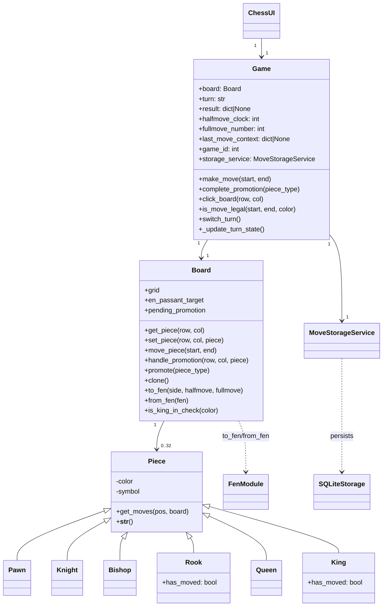
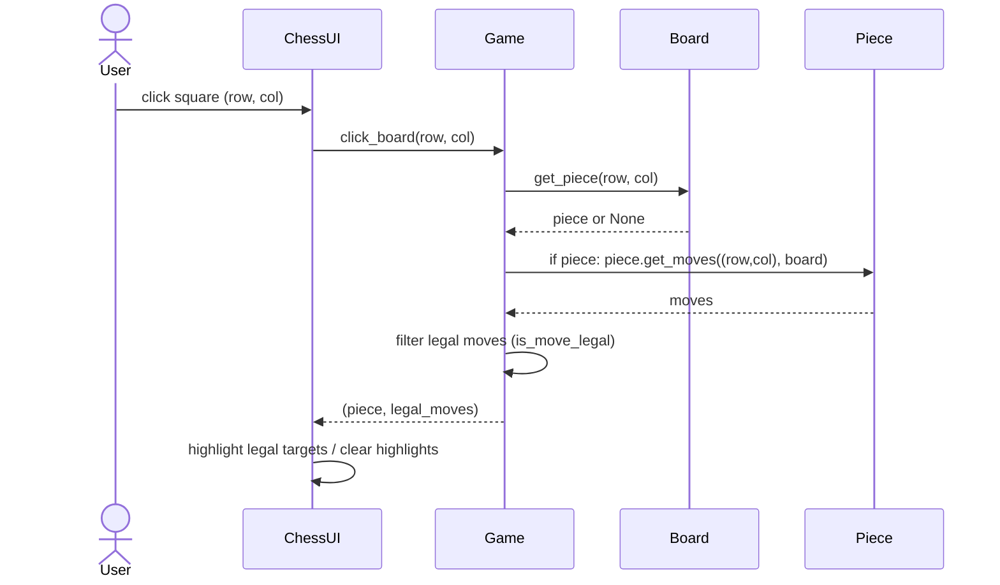
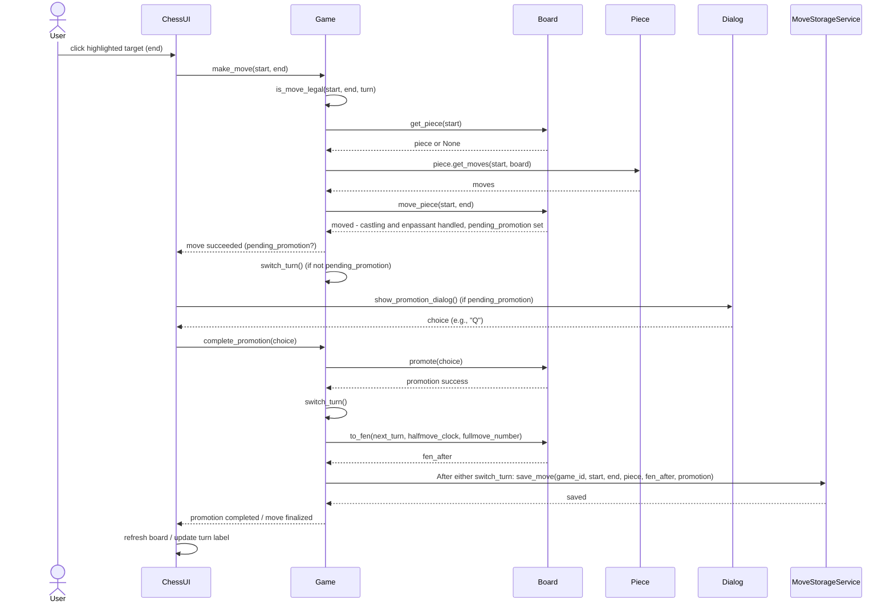

# Architecture

## Structure

The project currently has source files under
`src/` and responsibilities are grouped as follows:

- Presentation: `src/ui.py` (Tkinter UI, board rendering and dialogs)
- Application core: `src/game.py`, `src/board.py`, `src/piece.py`
- Persistence / services: `src/service.py`, `src/storage.py`, `src/schema.sql`
- Utilities: `src/fen.py` (FEN conversion)
- Assets: `assets/` (piece images used by the UI)

## App logic

## Main Functionality ##

The following sequence diagrams describe the primary user-visible flows.

### Piece Selection and Move Highlighting

When a user clicks a square the UI asks the Game for the piece and the
legal destinations. The Game asks the piece for generated moves and then
filters them using `is_move_legal`.

### Make Move and Promotion Handling

When the user clicks a highlighted destination the UI calls `make_move`.
`Board.move_piece` applies mutations and sets `pending_promotion` if a
pawn reached the last rank. If a promotion is pending the UI shows the
modal and calls `complete_promotion`. After the move is finalised the
Game asks the storage service to save the ply together with the FEN
after the move.

## Persistence

Persistence is handled by `MoveStorageService` (`src/service.py`) which
wraps `SQLiteStorage` (`src/storage.py`). The default database path is
`data/chess.db` and the schema is in `src/schema.sql`. The storage model
contains two tables:

- `games` — stores initial and final FEN and result metadata,
- `moves` — stores one row per ply with move coordinates, piece,
  optional promotion and the FEN after the move.

