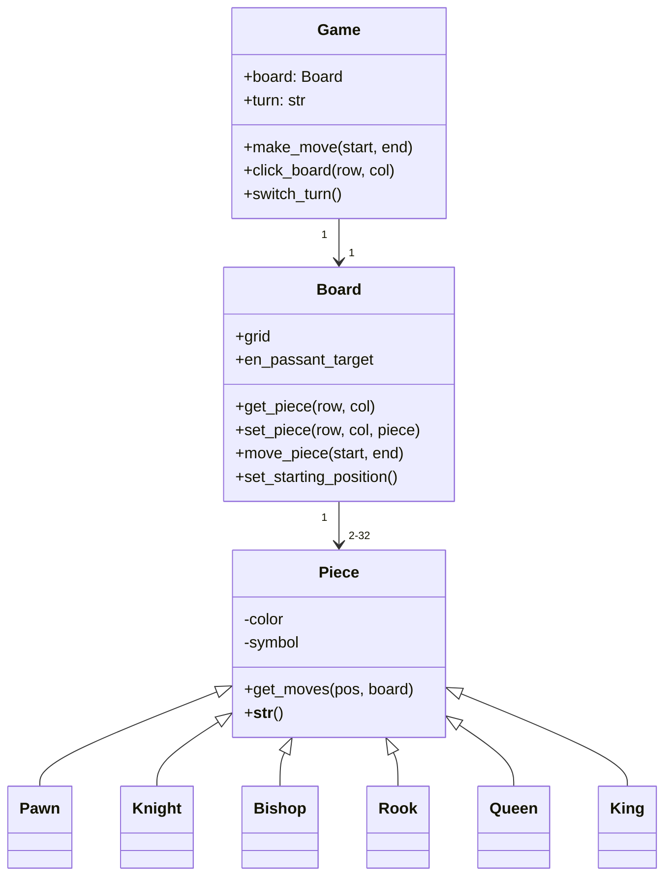

# Architecture

## App logic

```mermaid
classDiagram
  Game "1" --> "1" Board
  Board "1" --> "2-32" Piece

  class Game {
    +board: Board
    +turn: str
    +make_move(start, end)
    +click_board(row, col)
    +switch_turn()
  }

  class Board {
    +grid
    +en_passant_target
    +get_piece(row, col)
    +set_piece(row, col, piece)
    +move_piece(start, end)
    +set_starting_position()
  }

  class Piece {
    -color
    -symbol
    +get_moves(pos, board)
    +__str__()
  }

  class Pawn
  class Knight
  class Bishop
  class Rook
  class Queen
  class King

  Piece <|-- Pawn
  Piece <|-- Knight
  Piece <|-- Bishop
  Piece <|-- Rook
  Piece <|-- Queen
  Piece <|-- King
```

