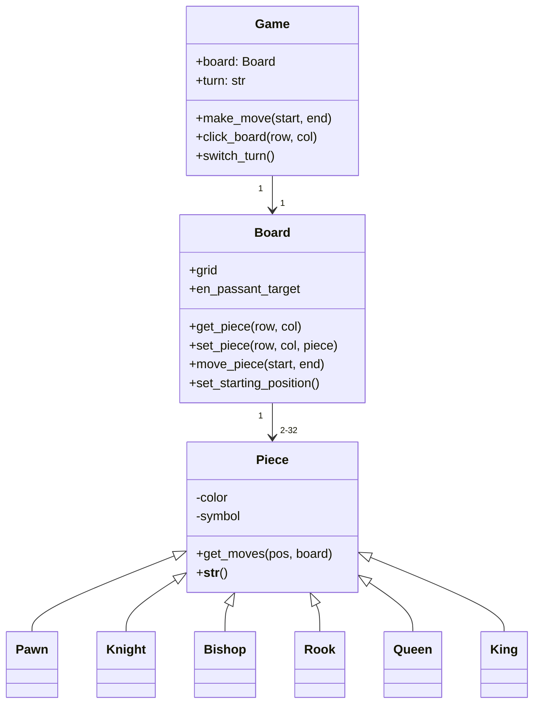
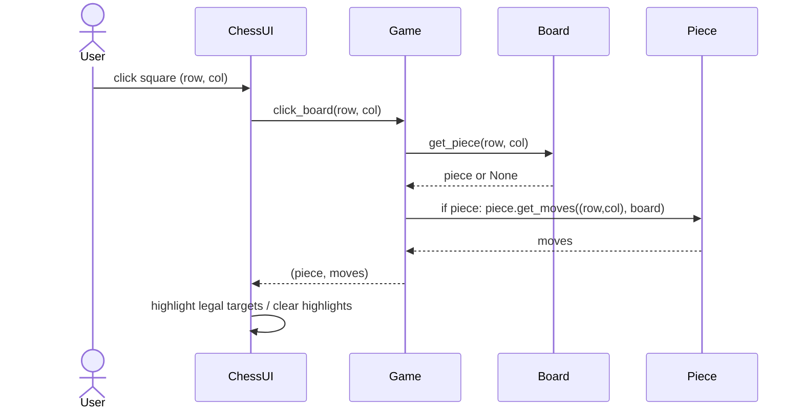
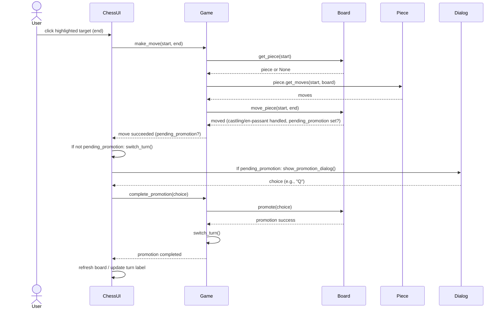

# Architecture

## App logic

```mermaid
classDiagram
  Game "1" --> "1" Board
  Board "1" --> "2-32" Piece

  class Game {
    +board: Board
    +turn: str
    +make_move(start, end)
    +click_board(row, col)
    +switch_turn()
  }

  class Board {
    +grid
    +en_passant_target
    +get_piece(row, col)
    +set_piece(row, col, piece)
    +move_piece(start, end)
    +set_starting_position()
  }

  class Piece {
    -color
    -symbol
    +get_moves(pos, board)
    +__str__()
  }

  class Pawn
  class Knight
  class Bishop
  class Rook
  class Queen
  class King

  Piece <|-- Pawn
  Piece <|-- Knight
  Piece <|-- Bishop
  Piece <|-- Rook
  Piece <|-- Queen
  Piece <|-- King
```

## Main Functionality ##

### Piece Selection and Move Highlighting

```mermaid
sequenceDiagram
  actor User
  participant UI as ChessUI
  participant Game
  participant Board
  participant Piece
  User->>UI: click square (row, col)
  UI->>Game: click_board(row, col)
  Game->>Board: get_piece(row, col)
  Board-->>Game: piece or None
  Game->>Piece: if piece: piece.get_moves((row,col), board)
  Piece-->>Game: moves
  Game-->>UI: (piece, moves)
  UI->>UI: highlight legal targets / clear highlights
```

### Make Move and Promotion Handling

```mermaid
sequenceDiagram
  actor User
  participant UI as ChessUI
  participant Game
  participant Board
  participant Piece
  participant Dialog
  User->>UI: click highlighted target (end)
  UI->>Game: make_move(start, end)
  Game->>Board: get_piece(start)
  Board-->>Game: piece or None
  Game->>Piece: piece.get_moves(start, board)
  Piece-->>Game: moves
  Game->>Board: move_piece(start, end)
  Board-->>Game: moved (castling/en-passant handled, pending_promotion set?)
  Game-->>UI: move succeeded (pending_promotion?)
  UI->>UI: If not pending_promotion: switch_turn()
  UI->>Dialog: If pending_promotion: show_promotion_dialog()
  Dialog-->>UI: choice (e.g., "Q")
  UI->>Game: complete_promotion(choice)
  Game->>Board: promote(choice)
  Board-->>Game: promotion success
  Game->>Game: switch_turn()
  Game-->>UI: promotion completed
  UI->>UI: refresh board / update turn label
```
