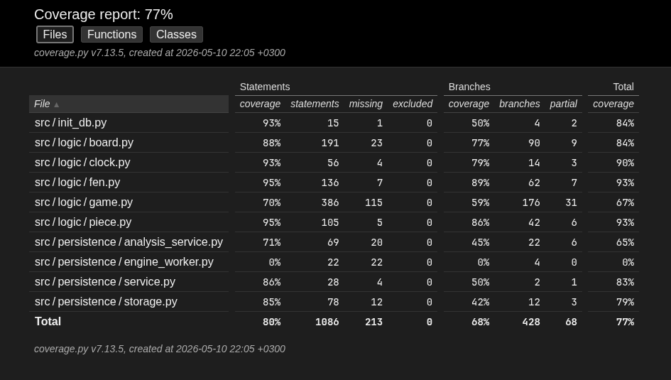

# Testing document

The application has been tested with automated unit and integration tests using `unittest`, and with manual system-level testing.

## Unit and integration testing

### Application logic

The main game logic is tested with the `TestGame` test class in `src/tests/test_game.py`.
The tests focus on the `Game` class, which is responsible for move validation,
turn handling, game-end detection, move counters, SAN notation generation, and
cooperation with the persistence layer.

In these tests, the game is initialized with a `FakeStorageService` instead of the
real database-backed storage service. This allows the tests to verify that moves
and finished game states are persisted at the correct moments without relying on
SQLite.

### Board, piece and FEN logic

Board-level behaviour is tested in `src/tests/test_board.py`. These tests cover
the `Board` class methods that mutate board state and support rule enforcement,
such as normal movement, castling, en passant, promotion setup, and attack
detection.

FEN parsing and serialization are tested in `src/tests/test_fen.py`. The tests
verify that the board can be converted to FEN correctly, reconstructed from FEN,
and that invalid FEN strings raise appropriate errors.

Clock related test are done in `src/tests/test_clock.py`. The tests verify that the
clock state starts, updates and returns correctly.

### Persistence

Service system is tested in `src/tests/test_service.py`. These test use a FakeStorage
to verify that the service provides the correct answers and works like expected.

The storage tests are in `src/tests/test_storage.py`. These have the db be in memory
so nothing is saved permanently from the tests. The tests verify that the app saves 
info correctly.

The tests in `src/tests/test_init_db.py` test that the db initialization works like 
expected.

The Stockfish engine is tested minimally in `src/tests/test_analysis_service.py`. It tests caching and move evaluation saving

## Branch coverage

Branch coverage while ignoring test and UI files

## System testing

System testing has been done manually.

### Installation and setup

The application has been installed and started by following the steps described in the
[user instructions](./user-instructions.md) in Linux environments.

### Functionality

The manually tested functionality includes the main user-visible features of the
application, such as:

- creating a new untimed game
- creating a new timed game with a chess clock
- selecting pieces and showing legal moves
- rejecting illegal moves
- castling, en passant, and promotion
- game end situations such as checkmate, stalemate, repetition, and insufficient material
- saving games and move history
- continuing unfinished games from history
- reviewing finished games move by move
- chess engine loading and its evaluation

### Missing / things to improve
- The chess engine related things have minimal automated testing
- Some new additions to game class are not tested that thoroughly
- No tests for the UI specifically
