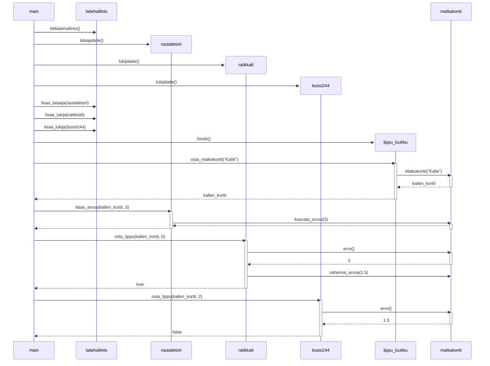

```mermaid
sequenceDiagram
    participant main
    participant laitehallinto 
    main ->> laitehallinto: hkllaitehallinto()
    create participant rautatietori
    main ->> rautatietori: lataajalaite()
    create participant ratikka6
    main ->> ratikka6: lukijalaite()
    create participant bussi244
    main ->> bussi244: lukijalaite()
    main ->> laitehallinto: lisaa_lataaja(rautatietori)
    main ->> laitehallinto: lisaa_lukija(ratikka6)
    main ->> laitehallinto: lisaa_lukija(bussi244)
    create participant lippu_luukku
    main ->> lippu_luukku: kioski()
    main ->> lippu_luukku: osta_matkakortti("Kalle")
    activate lippu_luukku
    lippu_luukku ->> matkakortti: Matkakortti("Kalle") 
    activate matkakortti
    matkakortti -->> lippu_luukku: kallen_kortti
    deactivate matkakortti
    lippu_luukku -->> main: kallen_kortti
    deactivate lippu_luukku
    main ->> rautatietori: lataa_arvoa(kallen_kortti, 3)
    activate rautatietori
    rautatietori ->> matkakortti: kasvata_arvoa(3)
    activate matkakortti
    matkakortti -->> rautatietori: 
    deactivate matkakortti
    rautatietori -->> main: 
    deactivate rautatietori
    main ->> ratikka6: osta_lippu(kallen_kortti, 0)
    activate ratikka6
    ratikka6 ->> matkakortti: arvo()
    activate matkakortti
    matkakortti -->> ratikka6: 3
    deactivate matkakortti
    ratikka6 ->> matkakortti: vahenna_arvoa(1.5)
    ratikka6 -->> main: true
    deactivate ratikka6
    main ->> bussi244: osta_lippu(kallen_kortti, 2)
    activate bussi244
    bussi244 ->> matkakortti: arvo()
    activate matkakortti
    matkakortti -->> bussi244: 1.5
    deactivate matkakortti
    bussi244 -->> main: false
    deactivate bussi244
```
